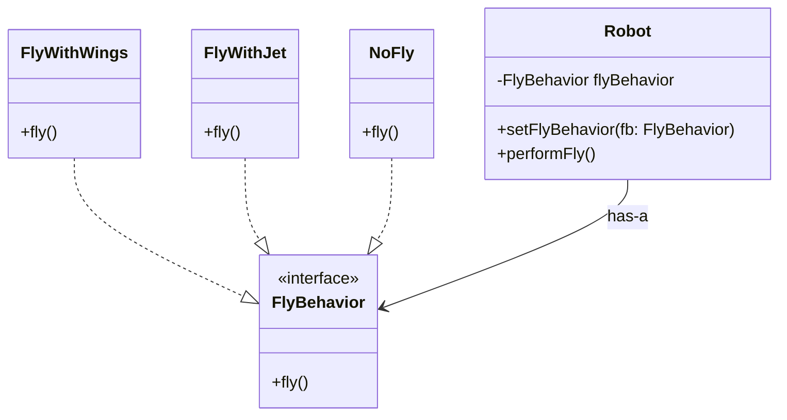

# Strategy Design Pattern

The Strategy pattern encapsulates interchangeable behaviors into separate classes, allowing the context to choose an algorithm at runtime without being tightly coupled to it.

---

## 1. Beginner Level: What is it?

Imagine you are building a simulation for **Robots**.

Initially, you have a `Robot` class with methods like `walk()` and `talk()`. Every new robot you create (e.g., `CompanionRobot`, `WorkerRobot`) inherits these behaviors.

### The Problem:
Suddenly, you want to add a `fly()` method. Not all robots can fly.
- If you add `fly()` to the parent class, even a "Worker Robot" that shouldn't fly will inherit the ability.
- If you use inheritance to solve this, your class tree becomes a "Spaghetti" of overrides and duplicates.

### The Core Idea:
Identify the parts of your code that change (the behaviors like flying, walking, or talking) and separate them from the parts that stay the same (the `Robot` object itself). Instead of "inheriting" a behavior, the robot **"has"** a behavior. This is called **Composition over Inheritance**.

---

## 2. Intermediate Level: How it works

The Strategy Pattern defines a family of algorithms, encapsulates each one, and makes them interchangeable.

1.  **Strategy Interface**: An interface for all supported algorithms (e.g., `FlyBehavior`).
2.  **Concrete Strategies**: Specific implementations (e.g., `FlyWithWings`, `FlyWithJet`, `NoFly`).
3.  **Context (Client)**: The class that uses the strategy (e.g., `Robot`). It holds a reference to a strategy object and delegates the task to it.

---

## 3. Pro Level: Real-World Example & Implementation

In a professional environment (like a fintech company), you might use this for a **Payment System**. You have one `Checkout` class, but the "Strategy" for paying can be UPI, Credit Card, or Net Banking. You can swap these at runtime without changing the Checkout code (**obeying the Open/Closed Principle**).

### Java Implementation

```java
// 1. Define the Strategy Interface
interface FlyBehavior {
    void fly();
}

// 2. Concrete Implementations
class FlyWithWings implements FlyBehavior {
    public void fly() { System.out.println("Flying with wings!"); }
}

class FlyWithJet implements FlyBehavior {
    public void fly() { System.out.println("Flying with a jet pack!"); }
}

class NoFly implements FlyBehavior {
    public void fly() { System.out.println("I cannot fly."); }
}

// 3. The Context (Robot)
class Robot {
    private FlyBehavior flyBehavior;

    public Robot(FlyBehavior flyBehavior) {
        this.flyBehavior = flyBehavior;
    }

    public void setFlyBehavior(FlyBehavior fb) {
        this.flyBehavior = fb;
    }

    public void performFly() {
        flyBehavior.fly(); // Delegation
    }
}

// 4. Usage
public class Main {
    public static void main(String[] args) {
        Robot sparrowRobot = new Robot(new FlyWithWings());
        sparrowRobot.performFly(); // Output: Flying with wings!

        // Change behavior at runtime!
        sparrowRobot.setFlyBehavior(new FlyWithJet());
        sparrowRobot.performFly(); // Output: Flying with a jet pack!
    }
}
```

### Class Diagram (Robot Simulation)



---

## Why use it?

-   **Open/Closed Principle**: You can add new flying behaviors without touching the `Robot` class.
-   **Runtime Flexibility**: You can change a robot's behavior while the program is running.
-   **Code Reuse**: `FlyWithJet` can be reused by a `Drone` class or a `Vehicle` class.

**Summary for Interviews**: *"The Strategy pattern encapsulates interchangeable behaviors into separate classes, allowing the context to choose an algorithm at runtime without being tightly coupled to it."*
