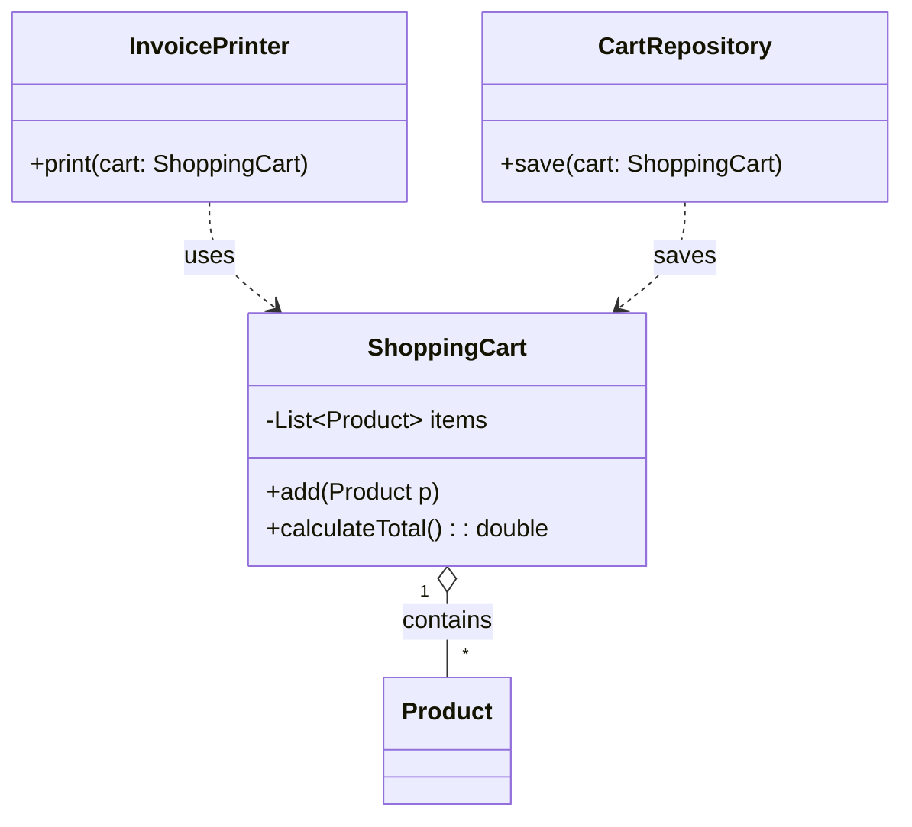

# SOLID Design Principles

What is SOLID?
SOLID is an acronym for five design principles that help developers avoid "spaghetti code" and tightly coupled systems.

- **S** - Single Responsibility Principle (SRP)
- **O** - Open/Closed Principle (OCP)
- **L** - Liskov Substitution Principle (LSP)
- **I** - Interface Segregation Principle (ISP)
- **D** - Dependency Inversion Principle (DIP)

---

## 1. Single Responsibility Principle (SRP)

"A class should have only one reason to change."

### The Concept:
A class should focus on a single task. If a class handles multiple responsibilities (e.g., calculating data, printing reports, and saving to a database), changing one part might accidentally break another.

### Example (Bad Design):
A `ShoppingCart` class that calculates the total price, prints the invoice, and saves the data to a database. If you change the database logic, you have to modify the `ShoppingCart` class.

### Example (Pro Design - SRP Followed):
Break the class into three specialized classes:
- **ShoppingCart**: Handles only the list of products and price calculation.
- **InvoicePrinter**: Handles the logic for printing invoices.
- **CartStorage**: Handles saving data to the database.

### Bad Design

```java
// This class is a "God Object" - it handles data, logic, and output.
class ShoppingCart {
    void addProduct(Product p) { /* logic */ }
    
    double calculateTotal() {
        // logic to sum prices
        return 100.0;
    }

    // VIOLATION: Why is the cart responsible for printing?
    void printInvoice() {
        System.out.println("Invoice details...");
    }

    // VIOLATION: Why is the cart responsible for Database logic?
    void saveToDatabase() {
        System.out.println("Saving to MySQL...");
    }
}
```

### Pro Design (SRP Followed)

```java
// 1. Only manages the data and calculation
class ShoppingCart {
    private List<Product> items = new ArrayList<>();
    public void add(Product p) { items.add(p); }
    public List<Product> getItems() { return items; }
    
    public double calculateTotal() {
        return items.stream().mapToDouble(Product::getPrice).sum();
    }
}

// 2. Only manages printing
class InvoicePrinter {
    public void print(ShoppingCart cart) {
        System.out.println("Printing invoice for items...");
    }
}

// 3. Only manages persistence
class CartRepository {
    public void save(ShoppingCart cart) {
        System.out.println("Saving to DB...");
    }
}
```

### Class Diagram (SRP Followed)


