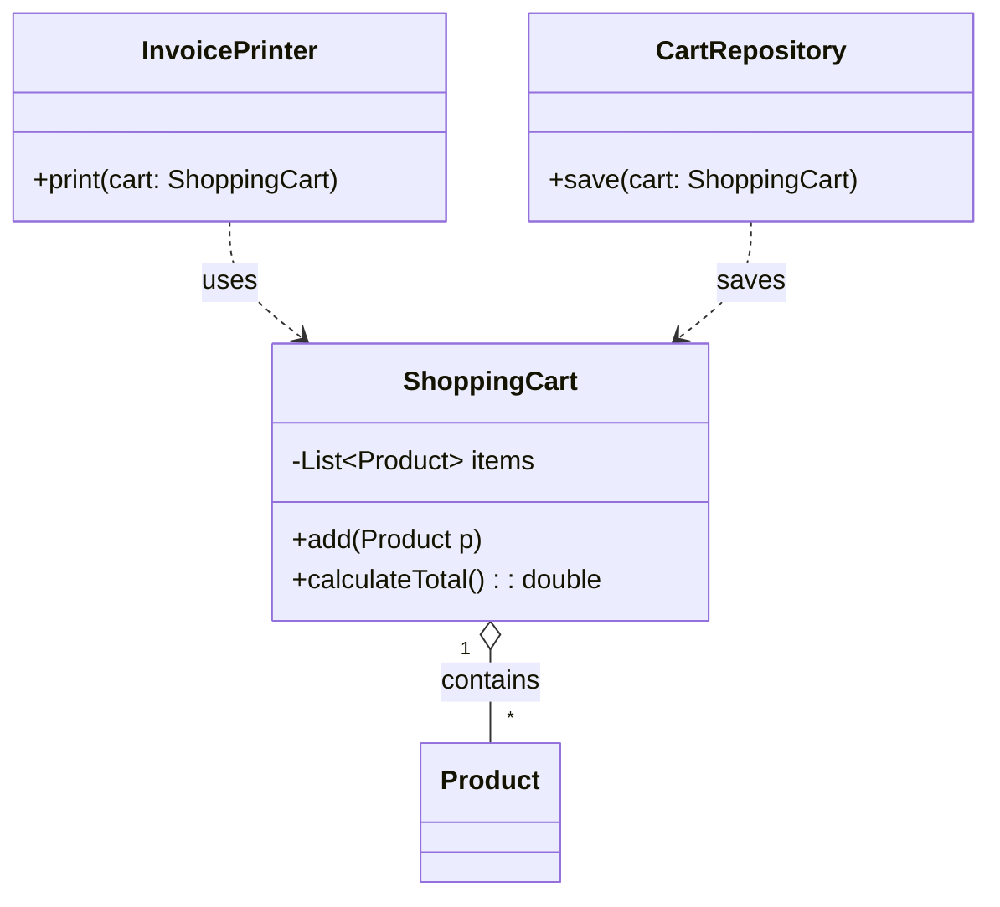
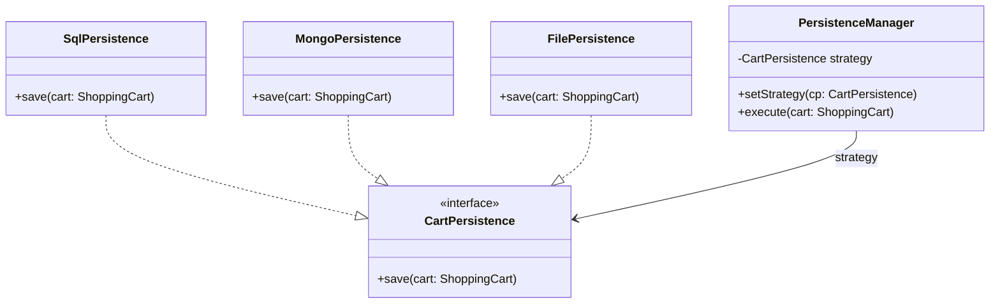
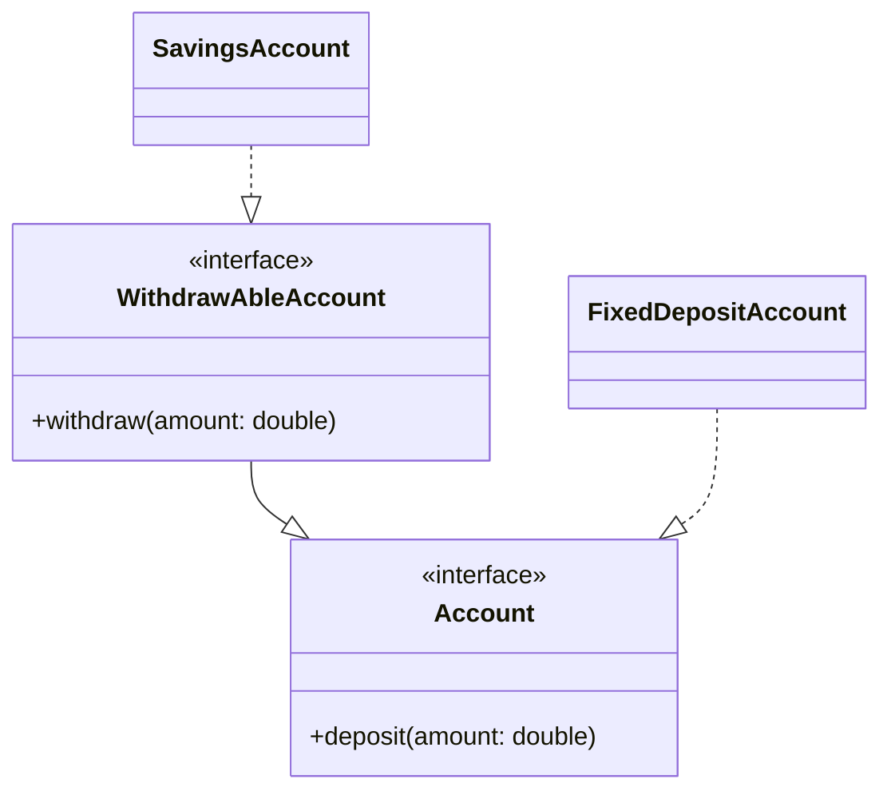
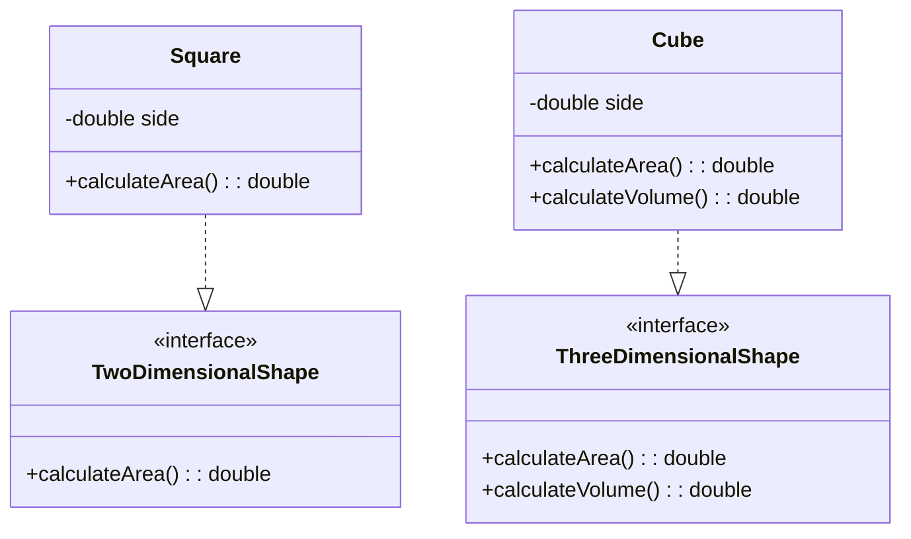
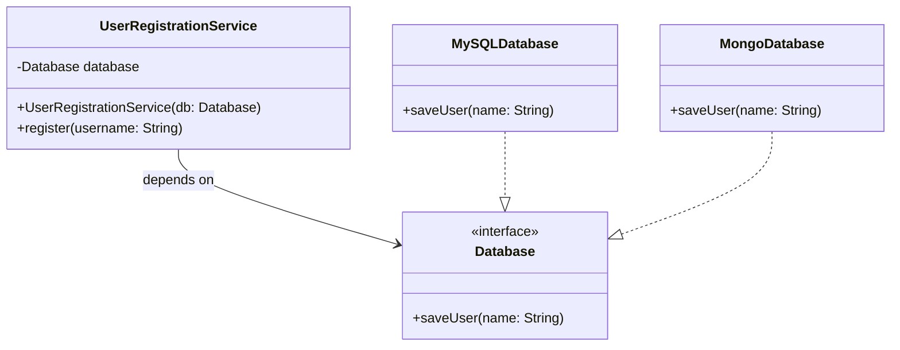

# SOLID Design Principles

What is SOLID?
SOLID is an acronym for five design principles that help developers avoid "spaghetti code" and tightly coupled systems.

- **S** - Single Responsibility Principle (SRP)
- **O** - Open/Closed Principle (OCP)
- **L** - Liskov Substitution Principle (LSP)
- **I** - Interface Segregation Principle (ISP)
- **D** - Dependency Inversion Principle (DIP)

---

## 1. Single Responsibility Principle (SRP)

"A class should have only one reason to change."

### The Concept:
A class should focus on a single task. If a class handles multiple responsibilities (e.g., calculating data, printing reports, and saving to a database), changing one part might accidentally break another.

### Example (Bad Design):
A `ShoppingCart` class that calculates the total price, prints the invoice, and saves the data to a database. If you change the database logic, you have to modify the `ShoppingCart` class.

### Example (Pro Design - SRP Followed):
Break the class into three specialized classes:
- **ShoppingCart**: Handles only the list of products and price calculation.
- **InvoicePrinter**: Handles the logic for printing invoices.
- **CartStorage**: Handles saving data to the database.

### Bad Design

```java
// This class is a "God Object" - it handles data, logic, and output.
class ShoppingCart {
    void addProduct(Product p) { /* logic */ }
    
    double calculateTotal() {
        // logic to sum prices
        return 100.0;
    }

    // VIOLATION: Why is the cart responsible for printing?
    void printInvoice() {
        System.out.println("Invoice details...");
    }

    // VIOLATION: Why is the cart responsible for Database logic?
    void saveToDatabase() {
        System.out.println("Saving to MySQL...");
    }
}
```

### Pro Design (SRP Followed)

```java
// 1. Only manages the data and calculation
class ShoppingCart {
    private List<Product> items = new ArrayList<>();
    public void add(Product p) { items.add(p); }
    public List<Product> getItems() { return items; }
    
    public double calculateTotal() {
        return items.stream().mapToDouble(Product::getPrice).sum();
    }
}

// 2. Only manages printing
class InvoicePrinter {
    public void print(ShoppingCart cart) {
        System.out.println("Printing invoice for items...");
    }
}

// 3. Only manages persistence
class CartRepository {
    public void save(ShoppingCart cart) {
        System.out.println("Saving to DB...");
    }
}
```

### Class Diagram (SRP Followed)



---

## 2. Open/Closed Principle (OCP)

"Software entities should be open for extension, but closed for modification."

### The Concept:
You should be able to add new functionality without touching existing code. This prevents breaking old features while adding new ones.

### Example (Bad Design):
A storage class where you add `saveToMongo()` and `saveToFile()` methods directly into the existing class. This modifies the existing class every time a new storage type is added.

### Example (Pro Design - OCP Followed):
Use an interface or abstract class. To add a new storage method, you simply create a new class that implements the interface.

### Bad Design

```java
class CartStorage {
    // VIOLATION: To add "File Storage", we must MODIFY this class.
    public void saveToSQL(ShoppingCart cart) { /* ... */ }
    
    public void saveToMongo(ShoppingCart cart) { /* ... */ }
}
```

### Pro Design (OCP Followed)

```java
interface CartPersistence {
    void save(ShoppingCart cart);
}

class SqlPersistence implements CartPersistence {
    public void save(ShoppingCart cart) { System.out.println("Saving to SQL"); }
}

class MongoPersistence implements CartPersistence {
    public void save(ShoppingCart cart) { System.out.println("Saving to Mongo"); }
}

class FilePersistence implements CartPersistence {
    public void save(ShoppingCart cart) { System.out.println("Saving to File"); }
}

// New features (like File storage) can be added by creating new classes 
// without modifying existing ones.

class PersistenceManager {
    private CartPersistence strategy;
    public void setStrategy(CartPersistence cp) { this.strategy = cp; }
    public void execute(ShoppingCart cart) { strategy.save(cart); }
}
```

### Class Diagram (OCP Followed)



---

## 3. Liskov Substitution Principle (LSP)

"Subclasses should be substitutable for their base classes."

### The Concept:
A child class must be able to stand in for its parent without the program crashing or behaving unexpectedly.

### Example (Bad Design):
An `Account` base class with `withdraw()`. A `FixedDepositAccount` inherits from `Account` but throws an exception on `withdraw()` because FDs have lock-in periods. This breaks the expectation that any `Account` can withdraw.

### Example (Pro Design - LSP Followed):
Split the interfaces based on actual behavior.

### Bad Design

```java
abstract class Account {
    abstract void deposit(double amount);
    abstract void withdraw(double amount);
}

class FixedDepositAccount extends Account {
    void deposit(double amount) { /* logic */ }
    
    @Override
    void withdraw(double amount) {
        // VIOLATION: Throws exception where parent says it should work.
        throw new UnsupportedOperationException("Withdrawal not allowed!");
    }
}
```

### Pro Design (LSP Followed)

```java
interface Account {
    void deposit(double amount);
}

interface WithdrawAbleAccount extends Account {
    void withdraw(double amount);
}

class SavingsAccount implements WithdrawAbleAccount {
    public void deposit(double amount) { /* ... */ }
    public void withdraw(double amount) { /* ... */ }
}

// FixedDeposit is now a true substitute for Account because it only 
// implements the deposit behavior it actually supports.
class FixedDepositAccount implements Account {
    public void deposit(double amount) { /* ... */ }
}
```

### Class Diagram (LSP Followed)



---

## 4. Interface Segregation Principle (ISP)

"Many client-specific interfaces are better than one general-purpose interface."

### The Concept:
Don't force a class to implement methods it doesn't use. Instead of a "Fat Interface," create small, specific ones.

### Example (Pro Design):
Instead of a single `Shape` interface that has both `calculateArea()` and `calculateVolume()`, we split them. A `Square` shouldn't be forced to have a `volume()` method.

### Java Implementation

```java
// 🟢 Pro Design: Segregated Interfaces
interface TwoDimensionalShape {
    double calculateArea();
}

interface ThreeDimensionalShape {
    double calculateArea();
    double calculateVolume();
}

class Square implements TwoDimensionalShape {
    private double side;
    public Square(double side) { this.side = side; }
    
    @Override
    public double calculateArea() { return side * side; }
}

class Cube implements ThreeDimensionalShape {
    private double side;
    public Cube(double side) { this.side = side; }

    @Override
    public double calculateArea() { return 6 * side * side; }
    @Override
    public double calculateVolume() { return Math.pow(side, 3); }
}
```

### Class Diagram (ISP Followed)



---

## 5. Dependency Inversion Principle (DIP)

"High-level modules should not depend on low-level modules. Both should depend on abstractions."

### The Concept:
Your Business Logic (High-level) should not be "stuck" to a specific Database or Tool (Low-level). Both should communicate via an Interface.

### Example (Pro Design):
A `UserService` (High-level) should not directly create a `MySQLDatabase` (Low-level). Instead, it should depend on a `Database` interface. This allows you to swap MySQL for MongoDB easily.

### Java Implementation

```java
// Abstraction (The Interface)
interface Database {
    void saveUser(String name);
}

// Low-level Module 1
class MySQLDatabase implements Database {
    public void saveUser(String name) {
        System.out.println("Saving " + name + " to MySQL...");
    }
}

// Low-level Module 2
class MongoDatabase implements Database {
    public void saveUser(String name) {
        System.out.println("Saving " + name + " to MongoDB...");
    }
}

// High-level Module (Depends only on the Abstraction)
class UserRegistrationService {
    private Database database;

    // Dependency Injection
    public UserRegistrationService(Database database) {
        this.database = database;
    }

    public void register(String username) {
        database.registerUser(username);
    }
}
```

### Class Diagram (DIP Followed)


